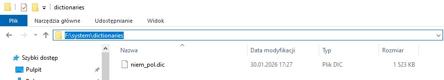

# 📚 Słownik Niemiecko-Polski depl.pl na PocketBooki
Najlepszy darmowy słownik niemiecko-polski (oparty na bazie **depl.pl**) przygotowany specjalnie na czytniki PocketBook w formacie `.dic`.

## 💼 Jak pobrać?
Kliknij [TUTAJ](https://github.com/Gergir/depl-pocketbook/releases/download/v1.0/niem_pol.dic) aby pobrać słownik lub użyj zakładki 'releases'.

## 👓 Jak zainstalować?

1. **Podłącz czytnik** do komputera kablem USB.
2. **Skopiuj pobrany plik** do folderu `system/resources/dictionaries` na czytniku.
  
(Jeśli nie widzisz folderu "system", możesz wpisać ścieżkę ręczkie w polu wyszukiwarki, tak jak na zdjęciu powyżej).
3. **Odłącz czytnik.** Gotowe! Słownik będzie dostępny na liście podczas czytania książki.  
   

## ⭐ Jeśli słownik Ci się przyda...

Przygotowanie tej wersji wymagało ręcznej poprawy wielu znaczników oraz błędów technicznych. Jeśli moja praca ułatwi Ci naukę, możesz zostawić gwiazdkę ⭐

## Podgląd
<table>
  <tr>
    <td>
      
    </td>
    <td>
      
    </td>
  </tr>
</table>

## 📝 Informacje o słowniku

* **Źródło bazy:** [depl.pl](http://www.depl.pl/) (Autor: Maciej Pańków). 
* **Zgoda:** Niniejsza wersja została udostępniona za oficjalną wiedzą i zgodą autora bazy głównej.
* **Licencja:** Słownik jest darmowy (Freeware). Zabrania się jego sprzedaży. Szczegóły dostępne w pliku [LICENSE](LICENSE).
* **Autorzy:** Informacje o autorach znajdują się pod hasłem '**O Słowniku**'  

